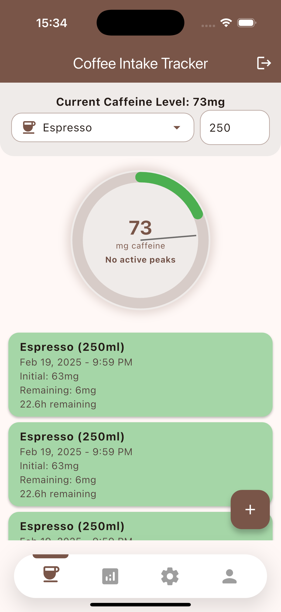

# Coffein Tracker

A Flutter application for tracking your daily caffeine intake and monitoring consumption patterns.

## Screenshots

<div style="display: flex; flex-wrap: wrap; gap: 10px;">
  
  
  
  
  
  
  
  
</div>

## Features
- Sign in with Google through Google OAuth - Supabase Auth
- Store data in Supabase
- Track various caffeinated beverages
- View daily, weekly, and monthly caffeine consumption statistics
- Track peak caffeine levels
- Personalized profile with caffeine sensitivity settings // TODO
- Customizable drink presets // TODO
- Visual consumption graphs and analytics // TODO
- Daily intake recommendations // TODO
- Notifications when reaching peak caffeine levels in the body

## Getting Started

### Prerequisites

- Flutter SDK (2.0 or higher)
- Dart SDK
- Android Studio / VS Code with Flutter extensions / Xcode (for iOS deployment)

### Installation

1. Clone the repository
2. Navigate to project directory
3. Create a `.env` file in the root directory and add your Supabase anon key and url:

    ```env
    key=your_supabase_anon_key
    url=your_supabase_project_url
    ```
4. Run `flutter pub get` to install dependencies
5. Open your simulator or connect your device
6. Run `flutter run` to start the application


## License

This project is licensed under the MIT License - see the [LICENSE](LICENSE) file for details.

## Acknowledgments
- Login and signup screens adapted from Moaz Sayed's Flutter authentication implementation (https://github.com/MoazSayed7/Flutter-Bloc_Cubit-Animated-Auth-Screens-Firebase-Login-SignUp-Reset-SignWithGoogle)
- Flutter team for the amazing framework
## Contact

[@EmreAliev](https://www.linkedin.com/in/emre-aliev)

Project Link: [https://github.com/EmreAliev948/CoffeinTracker](https://github.com/EmreAliev948/CoffeinTracker)